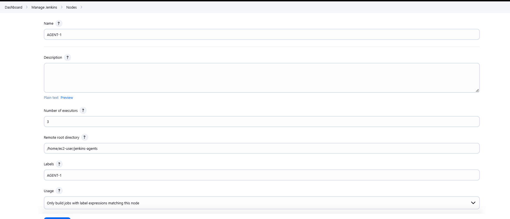
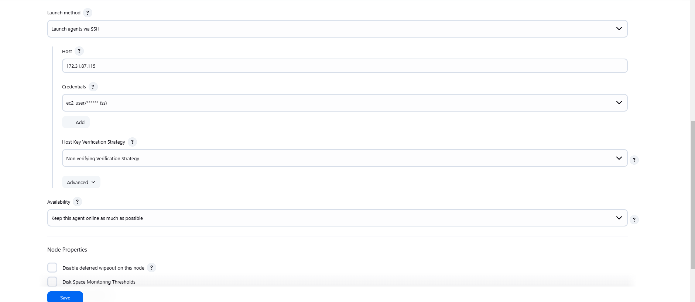

# CICD

manual steps to build the source code, run test cases, scan the code for static analystis using sonarqube, create artifact

and store the artifact into server like nexus

git clone
npm install
npm test
sonar scan
zip the application
push to nexus

we can automate these above steps using CICD

# jenkins installation

```
sudo curl -o /etc/yum.repos.d/jenkins.repo \
    https://pkg.jenkins.io/redhat/jenkins.repo
sudo rpm --import https://pkg.jenkins.io/redhat/jenkins.io-2023.key
sudo yum upgrade
# Add required dependencies for the jenkins package
sudo yum install fontconfig java-17-openjdk
sudo yum install jenkins
```

Ref: https://www.jenkins.io/doc/book/installing/linux/

example:

```
pipeline {
    agent any

    environment {
        SONARQUBE_URL = 'http://your-sonarqube-server'
        NEXUS_URL = 'http://your-nexus-server'
        NEXUS_REPO = 'your-repo'
        NEXUS_CREDENTIALS_ID = 'nexus-credentials'
    }

    stages {
        stage('Checkout') {
            steps {
                git 'https://github.com/your-repo.git'
            }
        }
        stage('Install Dependencies') {
            steps {
                sh 'npm install'
            }
        }
        stage('Run Tests') {
            steps {
                sh 'npm test'
            }
        }
        stage('SonarQube Analysis') {
            steps {
                withSonarQubeEnv('SonarQube') {
                    sh 'sonar-scanner'
                }
            }
        }
        stage('Package') {
            steps {
                sh 'zip -r application.zip .'
            }
        }
        stage('Upload to Nexus') {
            steps {
                script {
                    def nexusUrl = "${NEXUS_URL}/repository/${NEXUS_REPO}/application.zip"
                    sh "curl -u ${NEXUS_CREDENTIALS_ID} --upload-file application.zip ${nexusUrl}"
                }
            }
        }
    }
}
```

# Master Agent architecture





Jenkins follows a master-agent architecture to manage distributed builds and deployments. This architecture allows Jenkins to scale and handle multiple projects and build environments efficiently.

Key Components
Jenkins Master:

The central server that manages the Jenkins environment.
Responsible for scheduling build jobs, dispatching builds to agents, monitoring agents, and recording build results.
Provides the web UI for configuring jobs and viewing build results.
Can also execute build jobs directly, but it's recommended to delegate this to agents for better scalability.

Jenkins Agent:

A machine (physical or virtual) that is configured to execute build jobs dispatched by the master.
Can run on various platforms (Windows, Linux, macOS).
Communicates with the master to receive build instructions and report back the results.
How It Works

Job Configuration:

Jobs are configured on the Jenkins master through the web UI or configuration files.
Each job specifies the build steps, source code repository, triggers, and other settings.

Job Scheduling:

When a job is triggered (manually, by a commit, or on a schedule), the master schedules the job for execution.
The master selects an appropriate agent based on labels, availability, and resource requirements.

Job Execution:

The selected agent pulls the job configuration and executes the build steps.
The agent performs tasks such as checking out source code, running tests, building artifacts, and deploying applications.

Result Reporting:

The agent reports the build results back to the master.
The master records the results, updates the job status, and provides feedback through the web UI and notifications.

